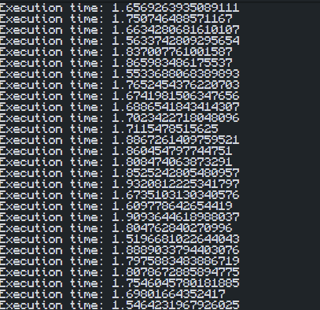
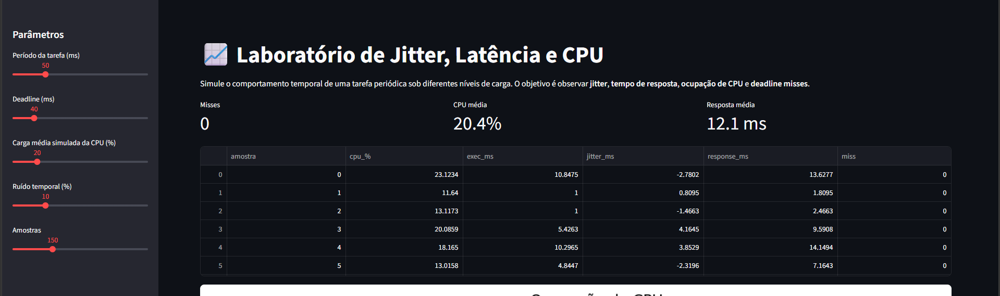

# Experimento 3 — Sobrecarga de CPU e Impacto Temporal

## Objetivo

Demonstrar que uma carga computacional excessiva pode aumentar o atraso de execução, introduzir variações temporais (jitter) e causar perdas de prazo (deadline misses).

---

## Parte 1 — CPU Overload

### Figura 1 – Execução do script de sobrecarga

O script executa uma operação computacional intensiva (10 milhões de iterações) a cada ciclo. Embora o período configurado seja de 20 ms, os tempos observados ficaram entre aproximadamente 1,5 s e 1,9 s por execução.

### Análise

Os resultados demonstram uma condição de sobrecarga da CPU. O tempo necessário para concluir cada ciclo é muito superior ao período desejado, impossibilitando o cumprimento dos requisitos temporais da tarefa.

---

## Parte 2 — Simulador de Jitter

### Figura 2 – Simulação com carga média de CPU de 20%

Nesta configuração foi utilizada uma carga média de CPU de 20%. O simulador registrou 0 deadline misses.

### Análise

Com baixa utilização da CPU, o sistema possui capacidade suficiente para executar as tarefas dentro dos limites temporais definidos. Não foram observadas perdas de prazo, indicando um comportamento temporal estável.

---

---

## Respostas das perguntas do experimento

### 1. Como a sobrecarga afeta tempo de resposta e jitter?

A sobrecarga aumenta significativamente o tempo de resposta das tarefas, pois o processador passa mais tempo executando operações antes de concluir cada ciclo. No experimento, observou-se que os tempos de execução ficaram entre aproximadamente 1,5 s e 1,9 s, muito acima do período desejado de 20 ms. Além disso, houve variação entre os tempos medidos, caracterizando a presença de jitter e reduzindo a previsibilidade temporal do sistema.

### 2. Existe uma faixa em que o sistema ainda é utilizável?

Sim. Em níveis baixos ou moderados de utilização da CPU, o sistema consegue atender aos requisitos temporais sem apresentar perdas de prazo. No simulador, com carga média de CPU de 20%, foram observados 0 deadline misses, indicando que o sistema ainda operava de forma estável e previsível.

### 3. Por que ocupação alta não significa, sozinha, sistema inútil?

Uma ocupação elevada da CPU não torna necessariamente o sistema inutilizável. O mais importante é verificar se as tarefas continuam atendendo seus deadlines. Dependendo do período das tarefas, da prioridade atribuída a elas e da carga total do sistema, é possível manter um funcionamento adequado mesmo com alta utilização da CPU. O sistema só se torna problemático quando os atrasos e as perdas de prazo passam a comprometer os requisitos temporais da aplicação.

---

## Conclusão

O experimento mostrou que a carga computacional influencia diretamente o comportamento temporal de um sistema. O script de sobrecarga apresentou tempos de execução muito superiores ao período desejado, caracterizando uma situação de processamento excessivo. Já no simulador, com apenas 20% de utilização média da CPU, não foram observadas perdas de prazo, evidenciando que cargas mais baixas favorecem a previsibilidade e o cumprimento dos requisitos temporais.
