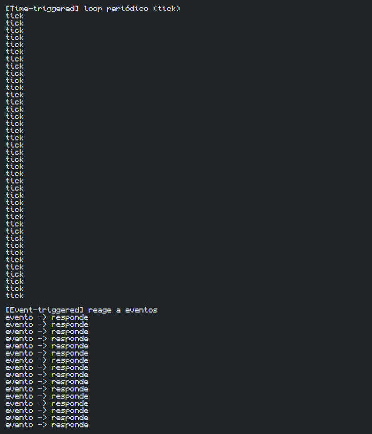

# Experimento: Time-Triggered vs Event-Triggered

## Objetivo do experimento

Comparar sistemas disparados por relógio (*time-triggered*) com sistemas disparados por evento (*event-triggered*).

---

## Descrição

O experimento demonstra duas formas de ativação de tarefas em sistemas de tempo real:

- **Time-triggered:** a tarefa é executada periodicamente em intervalos fixos de tempo.
- **Event-triggered:** a tarefa é executada apenas quando ocorre um evento.

Na primeira fase, o programa executa um loop periódico com período de 50 ms. Na segunda fase, a execução ocorre somente quando eventos são gerados em instantes aleatórios.

O objetivo é comparar regularidade, previsibilidade e capacidade de resposta das duas abordagens.

---

## Resultado Obtido

### Figura 1 – Saída do experimento

*Figura 1. Saída do programa mostrando a execução periódica da fase time-triggered, com 40 ticks distribuídos regularmente ao longo de 2 segundos, seguida da fase event-triggered, na qual 16 eventos foram processados conforme ocorreram.*

---

## Análise

Na fase **time-triggered**, foram observados 40 ticks executados em intervalos regulares, demonstrando alta previsibilidade e comportamento determinístico.

Na fase **event-triggered**, foram registrados 16 eventos durante o período de observação. As ativações ocorreram apenas quando eventos foram gerados, resultando em intervalos irregulares entre as execuções.

Os resultados mostram que a abordagem time-triggered oferece maior previsibilidade temporal, enquanto a abordagem event-triggered apresenta melhor capacidade de resposta a eventos.

---

## Respostas das perguntas do experimento

### 1. Qual modelo é mais previsível?

O modelo **time-triggered** é mais previsível, pois as tarefas são executadas em instantes conhecidos previamente e com intervalos fixos.

### 2. Qual modelo tende a reagir melhor a eventos raros?

O modelo **event-triggered** tende a reagir melhor a eventos raros, pois permanece aguardando a ocorrência do evento e executa somente quando necessário.

### 3. Em qual cenário embarcado você escolheria cada abordagem?

- **Time-triggered:** aplicações de controle periódico, como leitura de sensores, controle de motores e sistemas que exigem comportamento temporal previsível.
- **Event-triggered:** aplicações baseadas em interrupções, comunicação serial, acionamento por botões, alarmes e sistemas que precisam reagir rapidamente a eventos externos.

---

## Conclusão

O experimento demonstrou as diferenças entre os modelos time-triggered e event-triggered. O primeiro apresentou maior regularidade e previsibilidade, enquanto o segundo mostrou maior responsividade aos eventos. A escolha entre as duas abordagens depende dos requisitos temporais e do comportamento esperado da aplicação embarcada.
