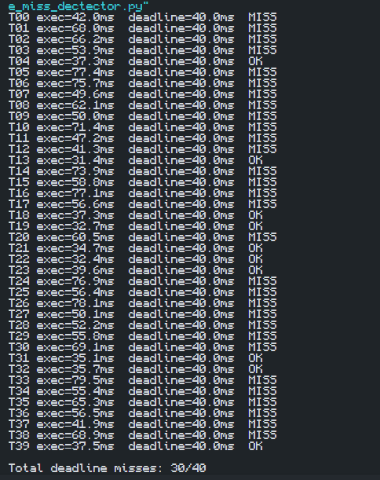

# Experimento: Detecção de Deadline Miss

## Objetivo do experimento

Utilizar um detector simples de *deadline miss* e relacionar a ocorrência de perdas de prazo ao tempo real de execução das tarefas.

---

## Descrição

O experimento simula uma tarefa periódica com período de 50 ms e deadline de 40 ms. A cada ciclo, a tarefa executa uma carga de trabalho artificial com duração variável. O tempo de execução é medido e comparado com o deadline estabelecido.

Quando o tempo de resposta da tarefa ultrapassa o deadline, o sistema registra um **deadline miss**.

Para aumentar a ocorrência de falhas temporais, a carga artificial foi ajustada para variar entre **30 ms e 80 ms**, tornando mais provável que algumas execuções excedam o prazo de 40 ms.

---

## Resultado Obtido

### Figura 1 – Saída do detector de deadline miss

*Figura 1. Saída do programa mostrando o tempo de execução de cada ciclo e a verificação do deadline. Com a carga artificial configurada entre 30 ms e 80 ms, foram observadas diversas ocorrências de "MISS", indicando que o tempo de resposta ultrapassou o prazo estabelecido.*

---

## Análise

Os resultados mostram que o aumento da carga computacional impacta diretamente o comportamento temporal da tarefa. Como o deadline foi definido em 40 ms, todas as execuções com tempo superior a esse valor foram classificadas como falhas temporais (*deadline misses*).

Durante a execução foram observados tempos variando aproximadamente entre 31 ms e 80 ms, evidenciando a existência de variação temporal (*jitter*) e demonstrando que tarefas mais demoradas possuem maior probabilidade de perder seus prazos.

---

## Respostas das perguntas do experimento

### 1. O que significa perder um deadline em sistemas hard, firm e soft?

- **Hard Real-Time:** perder um deadline é considerado uma falha do sistema. A resposta pode até estar correta, mas se chegar após o prazo, o resultado é inválido. Exemplos incluem sistemas de controle de aeronaves e dispositivos médicos críticos.

- **Firm Real-Time:** uma resposta entregue após o deadline perde seu valor e normalmente é descartada, mas a perda ocasional não causa falha catastrófica do sistema.

- **Soft Real-Time:** a perda de um deadline degrada a qualidade do serviço, porém o sistema continua funcionando. Exemplos incluem reprodução de vídeo, áudio e aplicações multimídia.

### 2. O detector mede causa ou apenas sintoma?

O detector mede apenas o **sintoma**, ou seja, identifica quando uma tarefa ultrapassa o prazo estabelecido. Ele não determina a causa do problema. As causas podem incluir sobrecarga de CPU, bloqueios por recursos compartilhados, escalonamento inadequado, excesso de interrupções ou outras fontes de atraso.

### 3. Qual seria uma ação corretiva simples?

Uma ação corretiva simples é **reduzir a carga computacional da tarefa**, diminuindo o tempo necessário para sua execução. Outras medidas incluem aumentar o deadline quando possível, reduzir a frequência de execução da tarefa, melhorar a priorização das tarefas ou utilizar mecanismos de escalonamento mais adequados, como os oferecidos por um sistema operacional de tempo real (RTOS).

---

## Conclusão

O experimento confirmou que o cumprimento de um deadline depende diretamente do tempo de execução da tarefa. Quando a carga computacional aumenta, o tempo de resposta também tende a aumentar, elevando a quantidade de *deadline misses*. Dessa forma, foi possível relacionar de maneira prática os conceitos de tempo de execução real, jitter e perdas de prazo em sistemas de tempo real.
