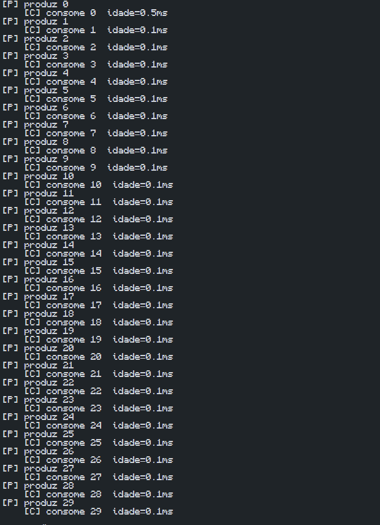

# Experimento: Comunicação entre Tarefas com Fila

## Objetivo do experimento

Entender como um buffer finito e diferentes velocidades de produção e consumo afetam a latência e o backlog em sistemas de tempo real.

---

## Descrição

O experimento utiliza uma fila (*queue*) para representar a comunicação entre duas tarefas concorrentes:

- **Produtor:** gera dados periodicamente e os insere na fila.
- **Consumidor:** remove os dados da fila e realiza o processamento.

A fila possui tamanho limitado (*buffer finito*), simulando uma situação comum em sistemas embarcados e sistemas operacionais de tempo real (RTOS).

Para analisar o impacto da velocidade de consumo, o consumidor foi alterado para utilizar:

```python
time.sleep(random.uniform(0.08, 0.15))
```

Dessa forma, o tempo de processamento do consumidor passou a variar entre 80 ms e 150 ms.

Durante a execução, o consumidor calcula a idade dos dados, isto é, o tempo decorrido entre a produção e o consumo de cada item.

---

## Resultado Obtido

### Figura 1 – Saída do experimento produtor-consumidor



*Figura 1. Saída do programa mostrando os itens produzidos e consumidos. Mesmo com o consumidor configurado para processar cada item entre 80 ms e 150 ms, a idade dos dados permaneceu próxima de 0 ms durante a execução observada.*

---

## Análise

Mesmo com o consumidor configurado para operar mais lentamente, os valores de idade permaneceram próximos de 0 ms durante a execução.

Isso indica que não houve acúmulo significativo de elementos na fila e que o consumidor conseguiu acompanhar a taxa de produção dos dados. Como consequência, o backlog permaneceu muito baixo e a latência observada foi mínima.

---

## Respostas das perguntas do experimento

### 1. Fila cheia significa necessariamente falha?

Não. Uma fila cheia indica que os dados estão sendo produzidos mais rapidamente do que são consumidos. Dependendo da aplicação, isso pode apenas causar atrasos temporários, embora também possa levar a bloqueios ou perda de dados.

### 2. Como o backlog afeta a latência fim a fim?

Quanto maior o backlog, mais tempo os itens permanecem esperando na fila. Isso aumenta a latência entre a produção e o processamento dos dados.

### 3. Por que filas são importantes em RTOS?

Filas permitem a comunicação entre tarefas que executam em velocidades diferentes, organizando a troca de dados e reduzindo problemas de sincronização.

---

## Conclusão

O experimento mostrou como filas são utilizadas para comunicação entre tarefas em sistemas de tempo real. Apesar da redução da velocidade do consumidor, não foi observado backlog significativo na execução registrada, mantendo a idade dos dados próxima de zero e a latência baixa.
