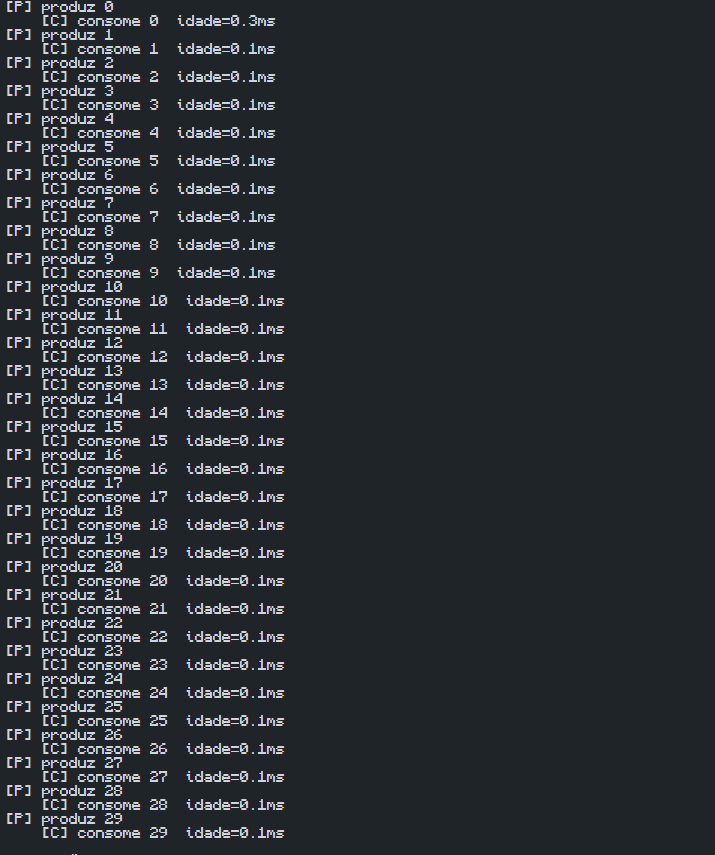

# Experimento: Comunicação entre Tarefas com Fila

## Objetivo do experimento

Entender como um buffer finito e diferentes velocidades de produção e consumo afetam a latência e o backlog em sistemas de tempo real.

---

## Descrição

O experimento utiliza uma fila (*queue*) para representar a comunicação entre duas tarefas concorrentes:

- **Produtor:** gera dados periodicamente e os insere na fila.
- **Consumidor:** remove os dados da fila e realiza o processamento.

A fila possui tamanho limitado (*buffer finito*), simulando uma situação comum em sistemas embarcados e sistemas operacionais de tempo real (RTOS).

Durante a execução, o consumidor calcula a idade dos dados, isto é, o tempo decorrido entre a produção e o consumo de cada item.

---

## Resultado Obtido

### Figura 1 – Saída do experimento produtor-consumidor

*Figura 1. Saída do programa mostrando os itens produzidos e consumidos, juntamente com a idade dos dados no momento do consumo.*

---

## Análise

Na execução observada, os valores de idade permaneceram próximos de 0 ms durante praticamente todo o experimento. Isso indica que o consumidor foi capaz de processar os itens na mesma velocidade em que eram produzidos.

Como consequência:

- Não ocorreu acúmulo significativo de elementos na fila.
- O backlog permaneceu muito baixo ou inexistente.
- A latência observada foi mínima.
- Os dados foram consumidos quase imediatamente após sua produção.

Esses resultados mostram que, quando produtor e consumidor possuem velocidades compatíveis, a fila não se torna um gargalo para o sistema.

---

## Respostas das perguntas do experimento

### 1. Fila cheia significa necessariamente falha?

Não necessariamente. Uma fila cheia indica que a taxa de produção está maior que a taxa de consumo naquele momento. Dependendo da aplicação, isso pode apenas causar atrasos temporários. Entretanto, se a fila permanecer cheia por longos períodos, podem ocorrer bloqueios do produtor, perda de dados ou degradação do desempenho do sistema.

### 2. Como o backlog afeta a latência fim a fim?

O backlog corresponde à quantidade de itens aguardando processamento na fila. Quanto maior o backlog, mais tempo cada item permanece esperando antes de ser consumido. Dessa forma, a latência fim a fim aumenta, pois o intervalo entre a produção e o processamento dos dados se torna maior.

### 3. Por que filas são importantes em RTOS?

Filas são importantes porque permitem a comunicação segura e organizada entre tarefas executadas concorrentemente. Elas desacoplam produtores e consumidores, possibilitando que cada tarefa execute em sua própria velocidade. Além disso, ajudam no compartilhamento de dados, na sincronização entre tarefas e no controle do fluxo de informações, recursos fundamentais em sistemas de tempo real.

---

## Conclusão

O experimento demonstrou a influência das velocidades relativas entre produtor e consumidor no comportamento temporal do sistema. Quando o consumidor consegue acompanhar a taxa de produção, a fila permanece pequena e a idade dos dados é reduzida. Já em situações de acúmulo de itens, o backlog aumenta, elevando a latência e tornando os dados progressivamente mais antigos antes de serem processados.
