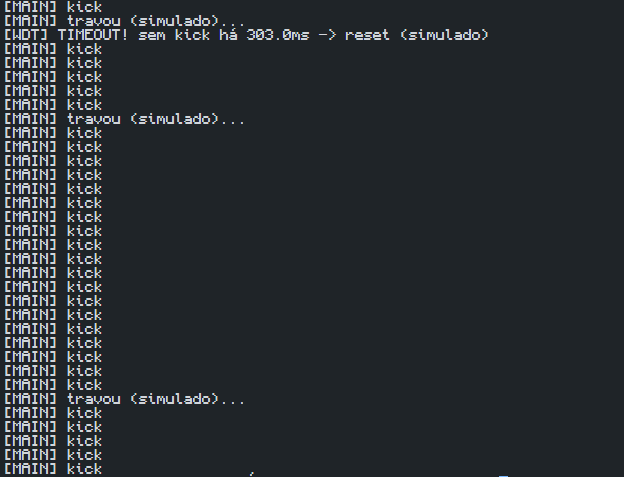

# Experimento: Watchdog Timer (WDT)

## Objetivo do experimento

Entender o papel do watchdog quando a tarefa principal deixa de responder.

---

## Descrição

O experimento simula o funcionamento de um **Watchdog Timer (WDT)**. A tarefa principal envia periodicamente um sinal de atividade (*kick*) para informar que continua executando normalmente.

O watchdog monitora o tempo desde o último *kick*. Caso esse tempo ultrapasse o limite configurado de **300 ms**, o watchdog considera que a tarefa travou e executa um **reset simulado**.

Durante a execução, foi introduzido um travamento artificial de **600 ms** para demonstrar o funcionamento do mecanismo de supervisão.

---

## Resultado Obtido

### Figura 1 – Saída do experimento de watchdog



*Figura 1. Saída do programa mostrando ciclos normais de execução ("kick"), a ocorrência de um travamento simulado e o disparo do watchdog após aproximadamente 303 ms sem receber um novo sinal de atividade.*

---

## Análise

Durante a execução, a tarefa principal enviou diversos *kicks* ao watchdog, indicando funcionamento normal. Em seguida ocorreu um travamento simulado, impedindo o envio de novos *kicks*.

Como o tempo sem resposta ultrapassou o timeout configurado de 300 ms, o watchdog detectou a falha e registrou:

```text
[WDT] TIMEOUT! sem kick há 303.0ms -> reset (simulado)
```

O resultado demonstra que o watchdog é capaz de identificar quando uma tarefa deixa de responder e tomar uma ação corretiva para recuperar o sistema.

---

## Respostas das perguntas do experimento

### 1. O watchdog previne o erro ou reage ao erro?

O watchdog não previne o erro. Ele reage ao erro detectando que o sistema deixou de responder dentro do tempo esperado e executando uma ação corretiva, como um reinício do sistema.

### 2. Quais riscos existem em timeouts mal calibrados?

Se o timeout for muito curto, o watchdog pode gerar reinicializações desnecessárias durante operações normais. Se for muito longo, a detecção de falhas pode demorar, permitindo que o sistema permaneça travado por mais tempo do que o aceitável.

### 3. Que sistemas precisam de watchdog?

Watchdogs são amplamente utilizados em sistemas embarcados, equipamentos industriais, dispositivos médicos, automóveis, sistemas de telecomunicações e qualquer aplicação que necessite de alta confiabilidade e recuperação automática em caso de falhas.

---

## Conclusão

O experimento mostrou que o watchdog atua como um mecanismo de segurança para detectar falhas de execução. Quando a tarefa principal deixou de responder por mais tempo que o timeout configurado, o watchdog identificou a situação e acionou um reset simulado, demonstrando sua importância para aumentar a confiabilidade de sistemas de tempo real.
