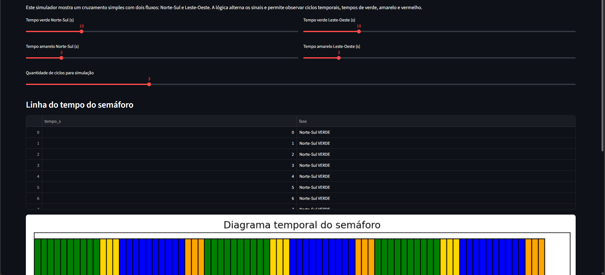

# Experimento: Simulador de Semáforo em Tempo Real

## Objetivo do experimento

Compreender a importância da previsibilidade temporal em sistemas de controle através da simulação de um semáforo com fases periódicas.

---

## Descrição

O experimento simula o funcionamento de um cruzamento com dois fluxos de tráfego:

- Norte-Sul
- Leste-Oeste

O sistema alterna automaticamente entre as fases de verde e amarelo para cada direção, respeitando os tempos configurados pelo usuário.

A simulação gera:

- Uma linha do tempo das fases.
- Um diagrama temporal do semáforo.
- A sequência completa de estados ao longo dos ciclos.

---

## Resultado Obtido

### Figura 1 – Simulador de semáforo

*Figura 1. Interface do simulador mostrando a linha do tempo das fases e o diagrama temporal do semáforo. Observa-se a alternância periódica entre os estados Norte-Sul Verde, Norte-Sul Amarelo, Leste-Oeste Verde e Leste-Oeste Amarelo.*

---

## Análise

Foram utilizados os seguintes parâmetros:

- Verde Norte-Sul: 10 s
- Amarelo Norte-Sul: 3 s
- Verde Leste-Oeste: 10 s
- Amarelo Leste-Oeste: 3 s
- 3 ciclos de simulação

A sequência observada foi:

1. Norte-Sul VERDE
2. Norte-Sul AMARELO
3. Leste-Oeste VERDE
4. Leste-Oeste AMARELO

Após o término da última fase, o ciclo reinicia na mesma ordem.

O diagrama temporal mostra que cada estado permanece ativo exatamente durante o intervalo configurado, garantindo comportamento previsível e repetitivo.

---

## Resposta da discussão

### Por que o sistema precisa ser previsível?

A previsibilidade é fundamental para garantir a segurança e a organização do tráfego. Cada fase deve ocorrer na ordem correta e durante o tempo programado para evitar conflitos entre os fluxos de veículos. Um comportamento imprevisível poderia causar congestionamentos ou até acidentes em um cruzamento real.

---

## Respostas das perguntas do experimento

### 1. Quais estados são temporizados?

Os estados temporizados são:

- Norte-Sul VERDE
- Norte-Sul AMARELO
- Leste-Oeste VERDE
- Leste-Oeste AMARELO

Cada estado permanece ativo durante um intervalo de tempo previamente configurado. Ao término desse intervalo, o sistema realiza a transição para a próxima fase do ciclo.

### 2. O semáforo é um exemplo de sistema hard, firm ou soft?

Um semáforo é normalmente considerado um sistema de tempo real **hard**.

Isso ocorre porque atrasos excessivos ou falhas na temporização podem comprometer a segurança do trânsito. Em uma implementação real, a sequência e os tempos das fases devem ser respeitados rigorosamente para evitar situações perigosas, como conflitos entre fluxos de veículos.

### 3. O que aconteceria se o período variasse demais?

Se os períodos variassem excessivamente, o comportamento do semáforo deixaria de ser previsível. Motoristas e pedestres não conseguiriam antecipar corretamente as mudanças de estado, aumentando o risco de acidentes, congestionamentos e decisões incorretas no trânsito.

Além disso, variações muito grandes poderiam causar desequilíbrio no fluxo de veículos, deixando algumas vias com tempo insuficiente ou excessivo para passagem.

---

## Conclusão

O experimento demonstrou o funcionamento de um sistema periódico típico de aplicações de tempo real. A execução previsível das fases e dos intervalos garante que o controle do tráfego ocorra de forma segura e organizada, evidenciando a importância da temporização em sistemas embarcados e de controle.
