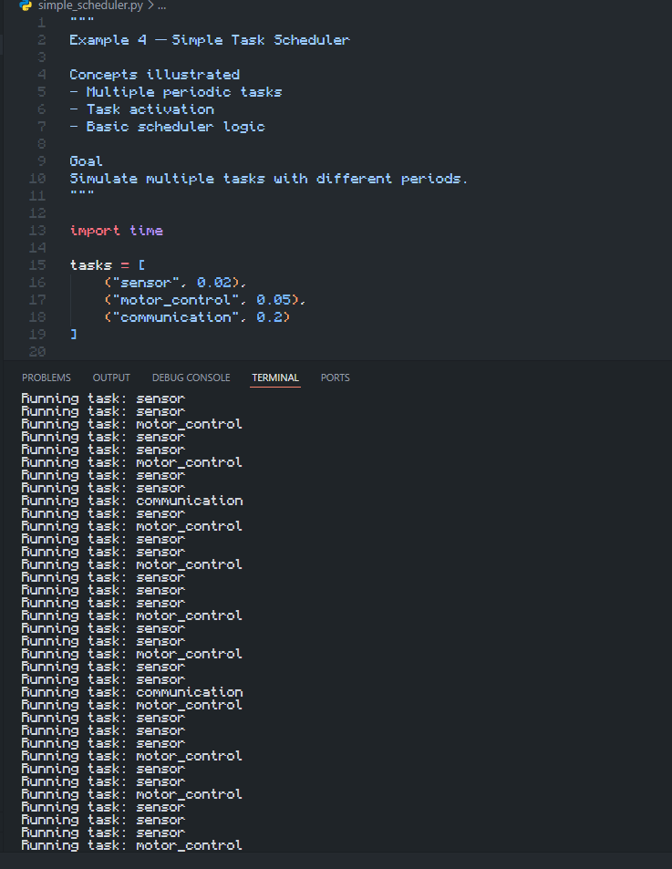

# Experimento: Escalonador Simples de Tarefas em Tempo Real

## Objetivo do experimento

Compreender o funcionamento básico de um escalonador de tarefas periódicas e como a carga do sistema influencia a execução de múltiplos jobs.

---

## Descrição

O experimento simula um escalonador simples baseado em verificação de tempo (polling), sem uso de RTOS.

O sistema possui três tarefas periódicas:

- sensor (período de 0.02 s)
- motor_control (período de 0.05 s)
- communication (período de 0.2 s)

O escalonador verifica continuamente o tempo e executa cada tarefa quando seu período expira.

Isso permite observar como tarefas com diferentes frequências convivem dentro de um único loop de execução.

---

## Resultado Obtido

### Figura 1 – Saída do escalonador em execução

*Figura 1. Saída do escalonador mostrando a ativação das tarefas sensor, motor_control e communication em diferentes frequências. Observa-se maior frequência da tarefa sensor devido ao menor período.*

---

## Análise

As tarefas configuradas possuem os seguintes períodos:

- sensor → 0.02 s
- motor_control → 0.05 s
- communication → 0.2 s

Durante a execução, observa-se que:

- A tarefa sensor é executada com maior frequência
- A tarefa communication aparece menos vezes
- motor_control possui frequência intermediária
- O sistema depende fortemente do loop principal para sincronização

Quando a carga do sistema aumenta, tarefas podem começar a atrasar, resultando em acúmulo de jobs e aumento da latência de execução.

---

## Procedimento do experimento

- Rode o script do escalonador simples.
- Liste as tarefas configuradas e os períodos.
- Observe quais jobs se acumulam quando a carga aumenta.

---

## Perguntas do experimento

### 1. O escalonador simples é suficiente para garantir deadlines?

Não. O escalonador simples baseado em polling não garante o cumprimento de deadlines, pois não há controle formal de prioridade, tempo de execução ou análise de escalonabilidade. Sob carga elevada, tarefas podem atrasar ou perder suas janelas de execução.

---

### 2. Quais informações faltam para uma análise completa?

Para uma análise completa seriam necessárias informações como:

- Tempo de execução (WCET) de cada tarefa
- Prioridades entre tarefas
- Jitter de execução
- Uso de CPU total do sistema
- Modelo de escalonamento (preemptivo ou cooperativo)
- Análise de escalonabilidade formal

---

### 3. O que muda quando saímos de uma lógica simples para RM ou EDF?

Ao usar algoritmos como Rate Monotonic (RM) ou Earliest Deadline First (EDF), o sistema passa a ter análise formal de escalonamento.

- RM: prioridade fixa baseada no período (menor período = maior prioridade)
- EDF: prioridade dinâmica baseada no deadline mais próximo

Esses métodos permitem:
- Garantia matemática de escalonabilidade (em condições específicas)
- Melhor utilização da CPU
- Maior previsibilidade temporal
- Suporte a sistemas de tempo real mais complexos

---

## Conclusão

O experimento mostra as limitações de um escalonador simples baseado em polling. Embora funcione para demonstração, ele não garante cumprimento de deadlines nem previsibilidade sob carga. Em sistemas reais, técnicas como RM e EDF são necessárias para garantir comportamento determinístico.
