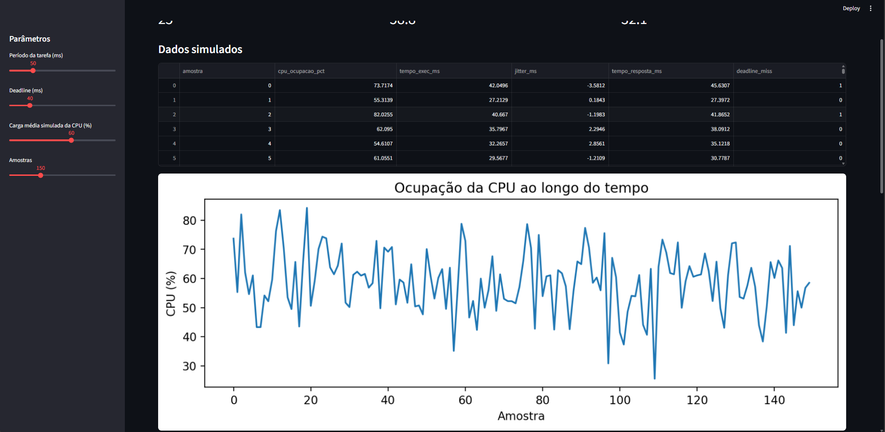
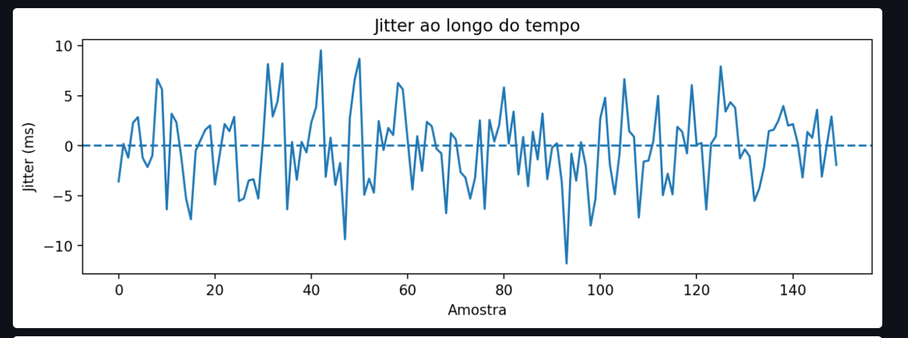
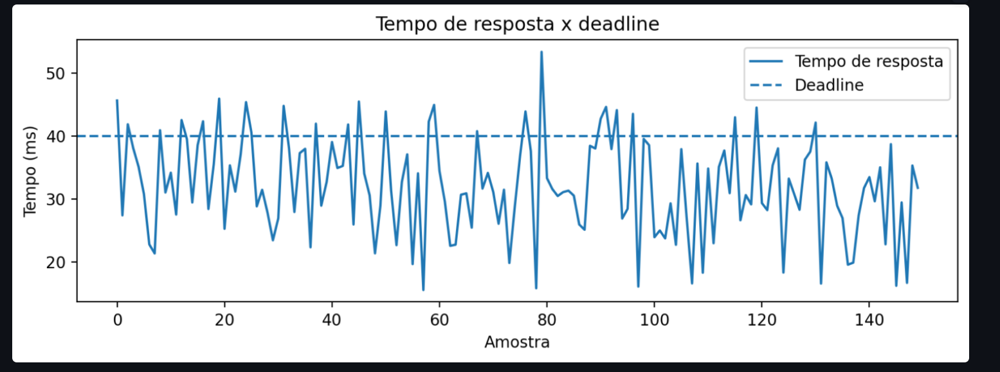
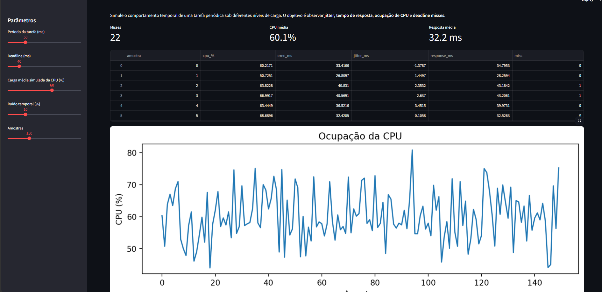
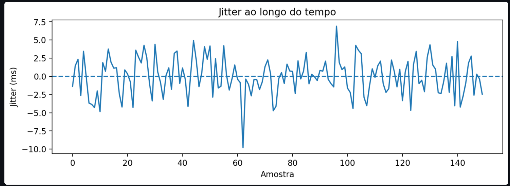
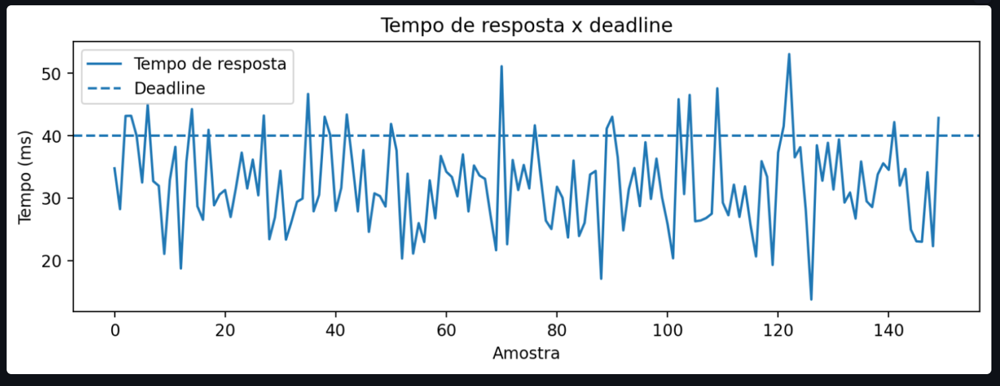

# Experimento: Simulador de Jitter e Tempo de Resposta 

## Objetivo do experimento

Simular o comportamento temporal de uma tarefa periódica sob diferentes níveis de carga e ruído, observando **jitter**, **tempo de resposta**, **ocupação de CPU** e **deadline misses**. Comparar como a introdução de ruído temporal afeta a previsibilidade do sistema.

---

## Descrição

O experimento utiliza um simulador que gera séries temporais de uma tarefa periódica configurável. Para cada amostra, o simulador registra:

- `cpu_%` - ocupação da CPU naquele instante
- `exec_ms` - tempo de execução da tarefa
- `jitter_ms` - desvio em relação ao tempo de execução esperado
- `response_ms` - tempo de resposta total da tarefa
- `miss` - indica se a deadline foi violada (response_ms > deadline)

Foram realizadas **duas rodadas** com os mesmos parâmetros base, diferenciadas pela introdução de **ruído temporal** na segunda rodada.

### Parâmetros utilizados

| Parâmetro | Rodada 1 (sem ruído) | Rodada 2 (com ruído) |
|---|---|---|
| Período da tarefa | 50 ms | 50 ms |
| Deadline | 40 ms | 40 ms |
| Carga média da CPU | 60% | 60% |
| Ruído temporal | - | 10% |
| Amostras | 150 | 150 |
| **Misses** | - | **22** |
| **CPU média** | - | **60,1%** |
| **Resposta média** | - | **32,2 ms** |

---

## Resultados Obtidos

### Rodada 1 - Sem ruído temporal

#### Figura 1 – Ocupação da CPU e tabela de dados (Rodada 1)

*Figura 1. Ocupação da CPU ao longo de 150 amostras sem ruído temporal. A carga oscila entre ~30% e ~85%, com média em torno de 60%. A tabela exibe as primeiras amostras com os campos cpu_ocupacao_pct, tempo_exec_ms, jitter_ms, tempo_resposta_ms e deadline_miss.*

---

#### Figura 2 – Jitter ao longo do tempo (Rodada 1)

*Figura 2. Jitter registrado na Rodada 1. Os valores oscilam de aproximadamente −12 ms a +10 ms em torno da linha zero (tracejada). A variação é irregular e sem tendência sistemática, caracterizando ruído estocástico puro da carga da CPU.*

---

#### Figura 3 – Tempo de resposta × Deadline (Rodada 1)

*Figura 3. Tempo de resposta comparado à deadline de 40 ms (linha tracejada). Vários picos ultrapassam a deadline, concentrados nas faixas aproximadas de amostras 0–10, 20–30, 40–50 e em torno da amostra 80. A maioria dos cruzamentos ocorre em instantes de pico de CPU.*

---

### Rodada 2 - Com ruído temporal de 10%

#### Figura 4 – Ocupação da CPU e tabela de dados (Rodada 2)

*Figura 4. Ocupação da CPU com ruído temporal de 10% adicionado. A média permanece em 60,1%, mas a variabilidade aumenta visivelmente, com picos chegando a ~80%. O simulador registrou 22 misses em 150 amostras.*

---

#### Figura 5 – Jitter ao longo do tempo (Rodada 2)

*Figura 5. Jitter na Rodada 2. A amplitude geral é menor que na Rodada 1 (~±7,5 ms), mas há um vale acentuado próximo à amostra 62 (≈ −10 ms), indicando um instante em que a tarefa adiantou consideravelmente. O ruído temporal adicionado introduz desvios sistemáticos localizados.*

---

#### Figura 6 – Tempo de resposta × Deadline (Rodada 2)

*Figura 6. Tempo de resposta com ruído de 10%. A deadline de 40 ms (tracejado) é cruzada com mais frequência e com picos mais altos (até ~53 ms em torno da amostra 70 e ~52 ms próximo à amostra 125). Os 22 misses distribuem-se ao longo de toda a simulação, sem concentração em uma única faixa.*

---

## Análise

### Comparação entre as duas rodadas

| Métrica | Rodada 1 | Rodada 2 |
|---|---|---|
| Ruído temporal | 0% | 10% |
| Deadline misses | - | **22** |
| Resposta média | - | 32,2 ms |
| Pico máximo de resposta | ~46 ms | ~53 ms |
| Amplitude do jitter | ~±12 ms | ~±10 ms |
| Padrão de misses | Concentrado em picos de CPU | Distribuído ao longo do tempo |

### Faixas em que o tempo de resposta cruza a deadline (40 ms)

**Rodada 1** - cruzamentos nas faixas aproximadas:
- Amostras 0–5 (~46 ms)
- Amostras 20–25 (~46 ms)
- Amostras 40–45 (~45 ms)
- Amostra ~80 (pico isolado ~53 ms)

**Rodada 2** - cruzamentos distribuídos, com destaques:
- Amostras 0–5 (~43 ms)
- Amostras 30–35 (~47 ms)
- Amostra ~70 (pico mais alto, ~51 ms)
- Amostras 100–105 (~46 ms)
- Amostra ~122 (pico ~52 ms)

A diferença qualitativa é clara: sem ruído, os misses ocorrem em surtos associados a picos de CPU. Com ruído, os misses se dispersam ao longo do tempo, tornando o sistema menos previsível mesmo em instantes de carga moderada.

---

## Procedimento realizado

1. O simulador foi executado com carga média de 60% e 150 amostras.
2. Na Rodada 1, nenhum ruído temporal foi adicionado - as séries temporais refletem apenas a variabilidade natural da carga da CPU.
3. Na Rodada 2, foi inserido um ruído temporal de 10%, simulando imprecisões de escalonamento ou interferências externas.
4. As faixas em que o tempo de resposta cruza a deadline foram registradas nos dois gráficos de resposta × deadline.

---

## Respostas das perguntas do experimento

### 1. Qual gráfico comunica melhor o problema?

O gráfico de **Tempo de resposta × Deadline** (Figuras 3 e 6) é o que comunica melhor o problema, pois ele responde diretamente à pergunta mais importante de um sistema de tempo real: *a tarefa cumpriu ou não cumpriu sua deadline?*

- O gráfico de CPU mostra causa, mas não consequência - uma CPU a 75% não diz se houve miss.
- O gráfico de jitter mostra variabilidade, mas em torno de zero - não evidencia violação.
- O gráfico de resposta × deadline é o único que torna visível **quando** e **o quanto** o sistema falhou, relacionando diretamente o comportamento observado ao requisito temporal.

Em sala de aula, ele é o gráfico que mais facilita a discussão: cada ponto acima da linha tracejada é um miss concreto, identificável e explicável.

---

### 2. Como diferenciar latência média de variabilidade?

São duas métricas distintas e complementares:

| Métrica | O que mede | Como observar nos gráficos |
|---|---|---|
| **Latência média** (resposta_ms médio) | O valor central do tempo de resposta | Linha horizontal imaginária ao redor de ~32 ms nos dados |
| **Variabilidade** (amplitude do jitter) | O quanto o tempo de resposta desvia da média | Amplitude do gráfico de jitter; distância entre picos e vales |

Um sistema pode ter **baixa latência média e alta variabilidade** - e ainda assim ser problemático, pois os picos ultrapassam a deadline mesmo que a média fique abaixo dela. Neste experimento, a resposta média foi 32,2 ms (bem abaixo de 40 ms), mas 22 amostras violaram a deadline por conta da variabilidade. Confundir as duas métricas leva a uma avaliação otimista e incorreta do sistema.

---

### 3. Que tipo de conclusão o aluno deve evitar ao usar dados simulados?

Três armadilhas comuns:

**a) Generalizar para sistemas reais sem ressalvas.** Dados simulados usam modelos simplificados de carga e ruído. Um simulador que gera CPU com distribuição normal não captura bursts reais, interrupções de hardware, contenção de barramento ou efeitos de cache - fenômenos que em sistemas embarcados reais podem triplicar o jitter observado.

**b) Concluir que o sistema é seguro porque a média está abaixo da deadline.** Como demonstrado neste experimento, média de 32,2 ms com deadline de 40 ms ainda produziu 22 misses. A média não garante nada em sistemas de tempo real - o que importa é o **pior caso** (WCET).

**c) Atribuir causalidade direta sem análise.** Por exemplo: *"o ruído de 10% causou exatamente 22 misses"*. Em dados simulados com componente aleatório, rodar novamente com os mesmos parâmetros produziria um número diferente de misses. Conclusões sobre causalidade exigem múltiplas rodadas e análise estatística, não uma única execução.

---

## Conclusão

O experimento demonstrou que **carga média e ruído temporal são causas independentes de deadline misses**. Com carga de 60% e sem ruído, o sistema viola a deadline apenas nos picos de CPU. Com ruído de 10%, os misses se distribuem de forma menos previsível, mesmo a carga permanecendo na mesma média. Isso evidencia que, em sistemas de tempo real, **controlar a utilização média não é suficiente** - a variabilidade temporal (jitter) precisa ser caracterizada e limitada para garantir o cumprimento das deadlines.
